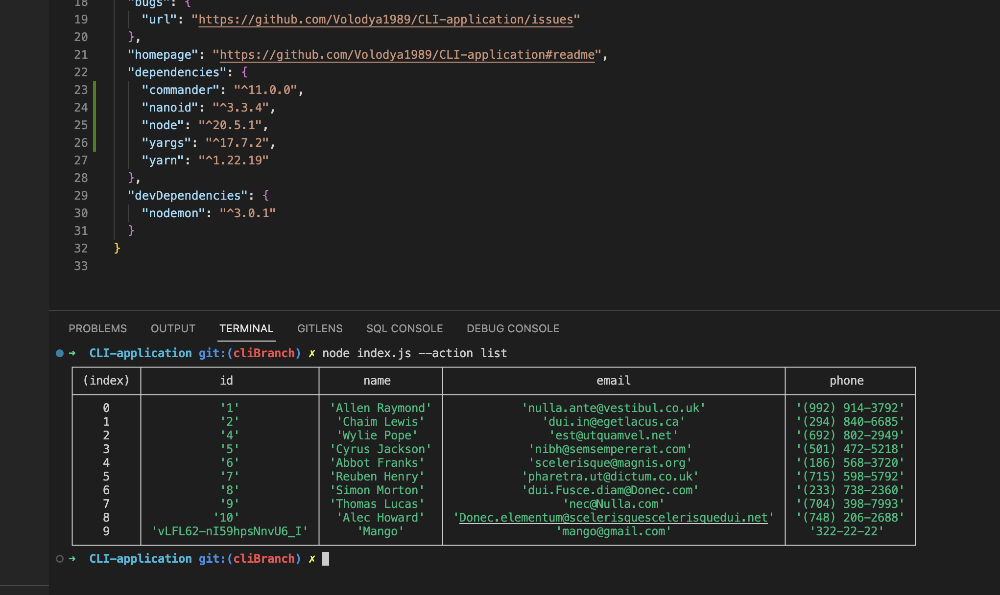
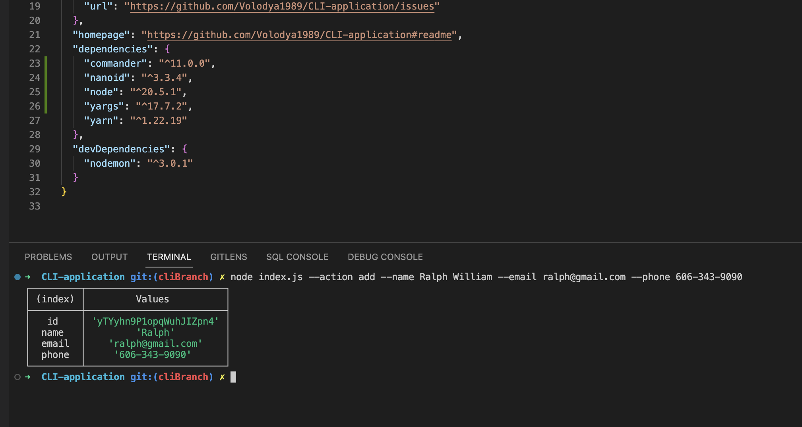
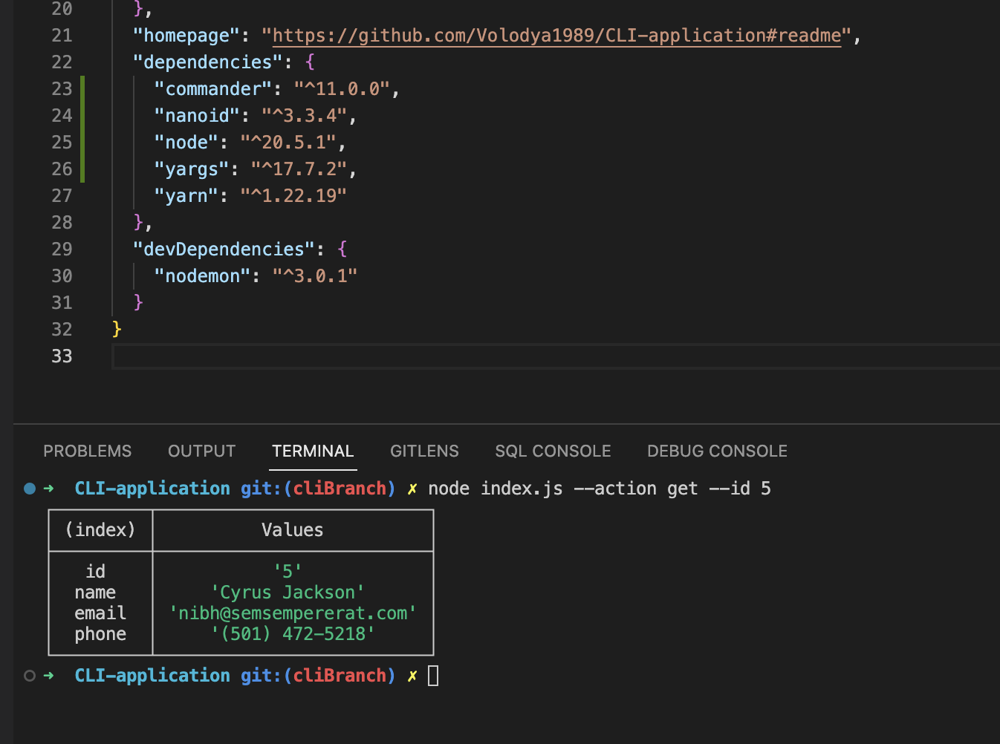

# Contacts Book CLI Application

## Table of Contents

- [Installation](#installation)
- [CLI Commands](#commands)
- [Usage](#usage)
- [Credits](#credits)
- [URL](#url)
- [License](#mit_license)

## Installation

1. Clone the repo.
2. Run npm install command in your terminal/bash.
3. Then run npm start OR npm run start:dev command in your terminal/bash.
## Commands
1. Get and display the entire list of contacts in the form of a table (console.table):
node index.js --action list

2. Get contact by id:
node index.js --action get --id 05olLMgyVQdWRwgKfg5J6

3. Add the contact:
node index.js --action add --name Mango --email mango@gmail.com --phone 322-22-22

4. Delete the contact:  
node index.js --action remove --id qdggE76Jtbfd9eWJHrssH

## Usage

This CLI Contacts Book Application was created as command line application for those people who
want to be able to view and manage their personal or business contact information,
so that they can organize and plan their personal/business life in a better way.

The following screenshot demonstrates the application functionality:

!

[Delete Contact](./images/3-deleteContact.png)

## Credits

This was a solo project comlepeted by Volodymyr Petrytsya as homework for the GOIT, FullStack Flex program.

## URL

There is no link to deployed website since it is command line application.

## MIT_License

Copyright (c) [2023][volodymyr petrytsya]

Permission is hereby granted, free of charge, to any person obtaining a copy
of this software and associated documentation files (the "Software"), to deal
in the Software without restriction, including without limitation the rights
to use, copy, modify, merge, publish, distribute, sublicense, and/or sell
copies of the Software, and to permit persons to whom the Software is
furnished to do so, subject to the following conditions:

The above copyright notice and this permission notice shall be included in all
copies or substantial portions of the Software.

THE SOFTWARE IS PROVIDED "AS IS", WITHOUT WARRANTY OF ANY KIND, EXPRESS OR
IMPLIED, INCLUDING BUT NOT LIMITED TO THE WARRANTIES OF MERCHANTABILITY,
FITNESS FOR A PARTICULAR PURPOSE AND NONINFRINGEMENT. IN NO EVENT SHALL THE
AUTHORS OR COPYRIGHT HOLDERS BE LIABLE FOR ANY CLAIM, DAMAGES OR OTHER
LIABILITY, WHETHER IN AN ACTION OF CONTRACT, TORT OR OTHERWISE, ARISING FROM,
OUT OF OR IN CONNECTION WITH THE SOFTWARE OR THE USE OR OTHER DEALINGS IN THE
SOFTWARE.
